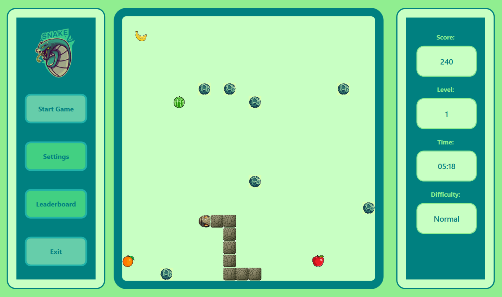
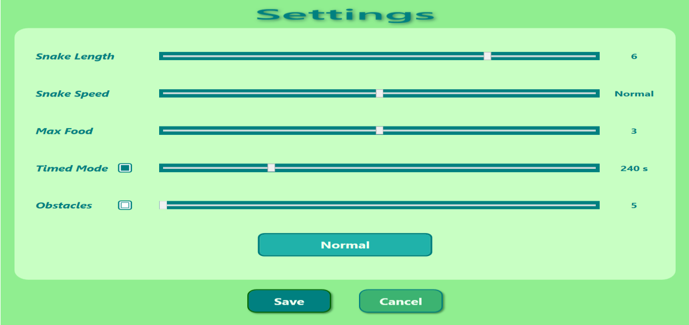
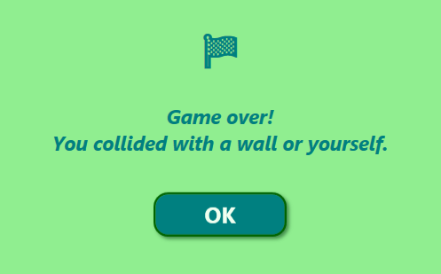
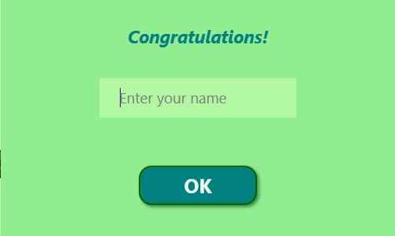
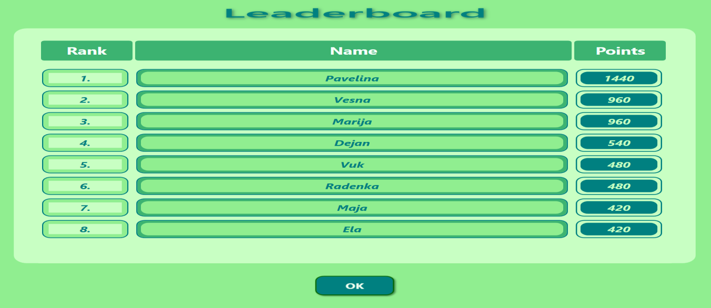

 
 

  <h1>Snake Game</h1> 

 
 
 

Implementacija klasične igre Snake razvijena u C# jeziku. Aplikacija podržava dinamičko prilagođavanje interfejsa promjeni veličine prozora, detaljnu konfiguraciju parametara igranja, automatsko određivanje težine i lokalno čuvanje najboljih rezultata na rang listi.

---

## 1. Mehanika igre

Igrač upravlja zmijom koja se kreće terenom, prikuplja raznovrsne vrste voća i vješto izbjegava prepreke.
* Svako pojedeno voće produžava zmiju i donosi poene, ali istovremeno povećava izazov jer postaje teže izbjeći prepreke, zidove ili sopstveno tijelo.
* Jedan pogrešan potez označava kraj igre.
* Zmija se kontroliše pomoću strelica na tastaturi $(\leftarrow, \uparrow, \downarrow, \rightarrow)$.

  

---

## 2. Pokretanje i kontrole na tastaturi

Aplikacija posjeduje sistem prečica za upravljanje prozorima i tokovima izvršavanja:

| Prečica | Funkcionalnost | Kontekst |
| :--- | :--- | :--- |
| `Ctrl + S` | Pokretanje nove partije (zmija se stvara u centru i kreće u nasumičnom smjeru) | Glavni meni |
| `Space` | Pauziranje i nastavak igre bez gubitka trenutnog stanja | Tokom aktivne igre |
| `F11` | Uključivanje i isključivanje fullscreen opcije | Bilo kada |
| `Ctrl + O` | Otvaranje prozora sa podešavanjima | Glavni meni (nedostupno tokom igre) |
| `Ctrl + L` | Pristup listi najboljih rezultata (Leaderboard) | Glavni meni (nedostupno tokom igre) |
| `Ctrl + Q` | Izlaz iz aplikacije uz prikaz dijaloga za potvrdu | Bilo kada |

*Napomena: Tokom igre veličina prozora se može slobodno mijenjati, a teren i sama zmija se automatski prilagođavaju novim dimenzijama.*

---

## 3. Podešavanja i automatsko skaliranje težine

Kroz prozor `Settings` moguće je konfigurisati sljedeće parametre prije početka partije:

* **Snake Length:** Određuje početnu dužinu zmije.
* **Snake Speed:** Postavlja početnu brzinu kretanja zmije.
* **Max Food:** Definiše maksimalan broj komada voća koji se istovremeno mogu pojaviti na terenu.
* **Timed Mode:** Omogućava opciono uključivanje vremenskog režima uz postavljanje vremenskog ograničenja partije u sekundama.
* **Obstacles:** Omogućava dodavanje statičkih prepreka na terenu i određivanje njihovog tačnog broja.

  

### Sistem računanja težine
Sistem na osnovu odabranih parametara automatski određuje težinu partije i svrstava je u jednu od tri kategorije: **Easy**, **Normal** ili **Hard**. Veća težina donosi više poena za svako pojedeno voće, ali predstavlja i veći izazov tokom igranja. Nakon što korisnik sačuva podešavanja, prikazuje se poruka potvrde.

---

## 4. Kriterijumi za završetak igre

Partija se automatski završava na jedan od četiri načina:

1. **Udarac u zid:** Sudar zmije sa spoljašnjim zidom terena.
2. **Udarac u tijelo:** Ako zmija udari u sopstveno tijelo.
3. **Udarac u prepreku:** Svaki dodir sa preprekama (ukoliko su uključene u podešavanjima).
4. **Istek vremena:** Kada tajmer dostigne nulu (ukoliko je aktiviran vremenski režim).

Po završetku partije, na ekranu se prikazuje dijalog sa obavještenjem o ishodu i tačnim razlogom završetka, poput „Collision" ili „Time up".

  
  

---

## 5. Rang lista (Leaderboard)

* Ako igrač nakon završetka partije osvoji dovoljan broj poena da se plasira među najbolje rezultate, prikazuje se dijalog za unos imena.
* Nakon unosa, rezultat se automatski dodaje na rang listu koja trajno čuva i prikazuje osam igrača sa najvećim brojem poena.

  

